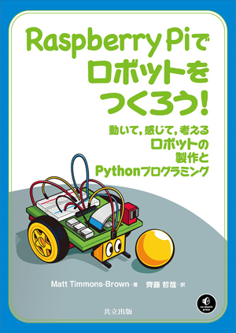
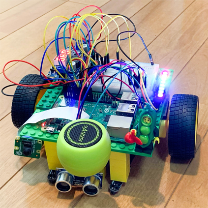

# Raspberry Piでロボットをつくろう！ - コードリポジトリ

## このリポジトリの説明

このリポジトリは，『[Learn Robotics with Raspberry Pi: Build and Code Your Own Moving, Sensing, Thinking Robots](https://nostarch.com/raspirobots/)』（Matt Timmons-Brown著，[No Starch Press](https://nostarch.com/)，2019年）を翻訳した『[Raspberry Piでロボットをつくろう！—動いて，感じて，考えるロボットの製作とPythonプログラミング—](https://www.kyoritsu-pub.co.jp/bookdetail/9784320124813)』（齊藤哲哉訳，[共立出版](https://www.kyoritsu-pub.co.jp/)，2021年）のコードリポジトリです。

原著のコードリポジトリである[https://github.com/the-raspberry-pi-guy/raspirobots](https://github.com/the-raspberry-pi-guy/raspirobots)で公開されているソースコードのうち，訳本で翻訳した部分を含めて公開しています。

また，訳本を読むうえで参考になる情報や正誤情報も公開していきます。訳本に間違いを見つけた場合は，お手数ですが[Issues](https://github.com/3110/raspirobots/issues/new/choose)に登録していただけるようお願いいたします。

## 書籍の詳細もくじ

**はじめに**

* なぜロボットをつくって学ぶのか？
* なぜRaspberry Piなのか？
* 本書の内容
* 本書が想定する読者
* 使用部品
* さあ，始めよう！

**第1章 起動する**

* Raspberry Piを入手する
  * Pi初体験
  * そのほかに必要なもの
* Raspberry Piを設定する
  * Windows/macOSでPiのオペレーティングシステムをインストールする
  * Raspberry Piに機器を接続する
  * Raspberry Pi OSをインストールする
  * Raspberry Pi OSを設定する
* 素晴らしきターミナルの世界
  * ターミナルを見て回る
  * 他のコンピュータからRaspberry Piに接続する
* プログラミングとは？
  * Python入門
  * 初めての Pythonプログラムを書く
* まとめ

**第2章 電子工学の基礎**

* 電気とは？
  * 抵抗
  * オームの法則
* LEDを点滅させる: Raspberry PiのGPIO出力
  * 部品リスト
  * LEDを配線する
  * Raspberry PiでLEDを点滅させるプログラムを書く
  * プログラムの実行: LEDを点滅させる
  * 挑戦しよう: 点滅の間隔を変える
* ボタンから入力する: Raspberry PiのGPIO入力
  * 部品の説明
  * ボタンを配線する
  * Raspberry Piでボタンからの入力を表示するプログラムを書く
  * プログラムの実行: ボタンからの入力を取得する
  * 挑戦しよう: ボタンからの入力と LED の点滅を連動させる
* まとめ

**第3章 ロボットをつくる**

* 初めてのロボット
* 部品リスト
  * 車台（シャーシ）
  * モーター
  * 電池
  * 電圧調整器
  * モーターコントローラ
  * 必要な道具
* ロボットを組み立てる
  * 車台をつくる
  * モーターを取り付ける
  * ロボットを安定させる
  * 電池を取り付ける
  * Raspberry Pi，ブレッドボード，降圧コンバータを取り付ける
  * Raspberry Piに繋ぐ電源を配線する
  * モーターを接続する
* まとめ

**第4章 ロボットを動かす**

* 部品リスト
* Hブリッジを理解する
* ロボットを初めて動かす
  * 事前に決めた経路でロボットを動かす
  * プログラムの実行: ロボットを動かす
* ロボットを遠隔操作する
  * Wiiリモコン
  * Bluetoothをインストールして使えるようにする
  * 遠隔操作機能をプログラミングする
  * プログラムの実行: ロボットを遠隔操作する
* モーターの回転速度を変える
  * PWMの仕組みを理解する
  * 加速度計を理解する
  * 加速度データを調べる
  * 遠隔移動操作を突き詰める
  * ロボットの速度を変えるプログラムを書く
  * プログラムの実行: PWMを使ってロボットを遠隔操作する
  * 挑戦しよう: 遠隔操作ロボットを改良する
* まとめ

**第5章 障害物を避ける**

* 障害物検知の方法を理解する
  * 超音波距離センサーによるアナログ物体検知
  * HC-SR04の仕組みを理解する
* 障害物までの距離を測定する
  * 部品リスト
  * 分圧器で電圧を下げる
  * HC-SR04を配線する
  * Raspberry Piで距離を取得するプログラムを書く
  * プログラムの実行: 障害物までの距離を測定する
* ロボットに障害物を回避させる
  * 超音波距離センサーHC-SR04を取り付ける
  * ロボットに障害物を避けさせるプログラムを書く
  * プログラムの実行: ロボットに障害物を避けさせる
  * 挑戦しよう: 障害物回避プログラムを改良する
* まとめ

**第6章 光と音で華やかにする**

* Raspberry PiロボットにNeoPixelを取り付ける
  * NeoPixelとRGB表色系
  * 部品リスト
  * NeoPixel Stickを配線する
  * ソフトウェアをインストールする
  * ライブラリのサンプルコードを設定する
  * サンプルコードを実行する
  * Wiiリモコンプログラムを使ってNeoPixelを操作する
  * プログラムの実行: NeoPixelをWiiリモコンで操作する
  * 挑戦しよう: 色とパターンを派手にする
* Raspberry Piロボットにスピーカーを取り付ける
  * 3.5mmスピーカーの仕組みを理解する
  * スピーカーを接続する
* Wiiリモコンプログラムに警笛音を追加する
  * ソフトウェアをインストールする
  * ターミナルから音を鳴らす
  * Wiiリモコンプログラムを使って音を鳴らす
  * プログラムの実行: NeoPixel，効果音，Wiiリモコンの操作
* 障害物を避けるプログラムにビープ音を追加する
  * 障害物を避けるプログラムにビープ音を組み込む
  * プログラムの実行: 障害物を避けるときにビープ音を鳴らす
  * 挑戦しよう: 別のプロジェクトに効果音を追加する
* まとめ

**第7章 線をたどる**

* 走路をつくる
* 線をたどるための理論
* 赤外線センサーを使って線を見つける
  * 部品リスト
  * TCRT5000線追従センサーモジュールを配線する
  * Raspberry Piで線を見つけるプログラムを書く
  * プログラムの実行: 線を見つける！
* ロボットに線をたどらせる
  * 2個目のTCRT5000モジュールを配線する
  * センサーを取り付ける
  * ロボットに線をたどらせるプログラムを書く
  * プログラムの実行: ロボットが線をたどる！
* まとめ

**第8章 コンピュータビジョン——色のついたボールを追いかける**

* コンピュータビジョンの役割
* 部品リスト
  * 目標物: 色のついたボール
  * 公式Raspberry Piカメラモジュール
* カメラモジュールを接続して設定する
  * カメラを取り付ける
  * カメラとVNCを有効にして画面の解像度を設定する
* テスト撮影する
  * VNCを使ってPiのデスクトップを遠隔から操作する
  * VNC Viewerをインストールして接続する
  * Raspberry Pi カメラモジュールを使って写真を撮影し表示する
* ロボットにボールを追いかけさせる
  * 色のついた物体を認識するために必要な理論を理解する
  * ソフトウェアをインストールする
  * 目的の色の色相値を調べる
  * HSVテストプログラムを実行する
  * ロボットにボールを追いかけさせるプログラムを書く
  * プログラムの実行: ロボットが色付きのボールを追いかける！
* まとめ

**次のステップ**

* Raspberry Pi Guy
* お気軽に連絡を！
* 他のウェブサイト
* 同好会・イベント
* 書籍・出版物

**Raspberry Pi の GPIO ピン配置図**

**抵抗値の計算方法**

**はんだ付け**

* 必要なもの
  * はんだ
  * はんだごて
  * こて台とこて先クリーナー
* 部品をはんだ付けする
  * はんだ付けの準備
  * こて先を錫メッキする
  * 部品の準備
  * 完璧な接合部のはんだ付け
* まとめ

**起動時にプログラムを実行する**

* rc.local ファイルを編集する
* 実践例

**訳者あとがき**

**索引**

## 部品表

[Supply chain, shortages, and our first-ever price increase](https://www.raspberrypi.com/news/supply-chain-shortages-and-our-first-ever-price-increase/)（「サプライチェーン，欠品，そして初めての値上げ」，2021年10月20日）に書かれている通り，世界的な半導体不足のため，Raspberry Piが手に入りにくい状況が続いています。特に，本書で使っているRaspberry Pi 3B+に関しては，一時的ですが他のモデル（Pi 3B，Compute Module 3/3+）の生産を優先する措置が取られています。しばらくはRaspberry Pi 3Bの方が入手しやすい状況が続くと思われますので，3Bを入手することをお勧めします。

※販売状況は2022年2月14日現在

<table>
    <thead>
        <tr>
            <th>部品</th>
            <th>購入先</th>
            <th>販売状況</th>
        </tr>
    </thaed>
    <tbody>
        <tr>
            <td rowspan=6>Raspberry Pi 3 Model B+スターターキット</td>
            <td><a href="https://ssci.to/3880" target="_blank">https://ssci.to/3880</a></td>
            <td>販売終了</td>
        </tr>
        <tr>
            <td>
                白，16GB <a href="https://raspberry-pi.ksyic.com/main/index/pdp.id/446/pdp.open/446" target="_blank">https://raspberry-pi.ksyic.com/main/index/pdp.id/446/pdp.open/446</a>
            </td>
            <td>入荷未定</td>
        </tr>
        <tr>
            <td>
                黒，16GB <a href="https://raspberry-pi.ksyic.com/main/index/pdp.id/447/pdp.open/447" target="_blank">https://raspberry-pi.ksyic.com/main/index/pdp.id/447/pdp.open/447</a>
            </td>
            <td>入荷未定</td>
        </tr>
        <tr>
            <td>
                透明，16GB <a href="https://raspberry-pi.ksyic.com/main/index/pdp.id/448/pdp.open/448" target="_blank">https://raspberry-pi.ksyic.com/main/index/pdp.id/448/pdp.open/448</a>
            </td>
            <td>入荷未定</td>
        </tr>
        <tr>
            <td>
            赤，16GB <a href="https://raspberry-pi.ksyic.com/main/index/pdp.id/449/pdp.open/449" target="_blank">https://raspberry-pi.ksyic.com/main/index/pdp.id/449/pdp.open/449</a>
            </td>
            <td>入荷未定</td>
        </tr>
        <tr>
            <td>
                透明，32GB <a href="https://raspberry-pi.ksyic.com/main/index/pdp.id/438/pdp.open/438" target="_blank">https://raspberry-pi.ksyic.com/main/index/pdp.id/438/pdp.open/438</a>
            </td>
            <td>入荷未定</td>
        </tr>
        <tr>
            <td rowspan=5>Raspberry Pi 3 Model B+</td>
            <td>
                <a href="https://ssci.to/3920" target="_blank">https://ssci.to/3920</a>（OKdo製）
            </td>
            <td>在庫あり</td>
        </tr>
        <tr>
            <td>
                <a href="https://ssci.to/3850" target="_blank">https://ssci.to/3850</a>（Element14製）
            </td>
            <td>入荷未定</td>
        </tr>
        <tr>
            <td>
                <a href="https://www.marutsu.co.jp/pc/i/1345410/" target="_blank">https://www.marutsu.co.jp/pc/i/1345410/</a>（RS版）
            </td>
            <td>入荷待ち</td>
        </tr>
        <tr>
            <td>
                <a href="https://www.marutsu.co.jp/pc/i/1349448/" target="_blank">https://www.marutsu.co.jp/pc/i/1349448/</a>（Element14版）
            </td>
            <td>入荷待ち</td>
        </tr>
        <tr>
            <td>
                <a href="https://akizukidenshi.com/catalog/g/gM-13470/" target="_blank">https://akizukidenshi.com/catalog/g/gM-13470/</a>（RS版）
            </td>
            <td>納期確認中</td>
        </tr>
        <tr>
            <td rowspan=4>Raspberry Pi 3 Model B</td>
            <td>
                <a href="https://ssci.to/3050" target="_blank">https://ssci.to/3050</a>
            </td>
            <td>入荷未定</td>
        </tr>
        <tr>
            <td>
                <a href="https://www.yodobashi.com/product/100000001003445642/" target="_blank">https://www.yodobashi.com/product/100000001003445642/</a>（アイ･オー･データ製）
            </td>
            <td>在庫なし</td>
        </tr>
        <tr>
            <td>
                <a href="https://www.marutsu.co.jp/pc/i/834053/" target="_blank">https://www.marutsu.co.jp/pc/i/834053/</a>
            </td>
            <td>入荷待ち</td>
        </tr>
        <tr>
            <td>
                <a href="https://akizukidenshi.com/catalog/g/gM-10414/" target="_blank">https://akizukidenshi.com/catalog/g/gM-10414/</a>
            </td>
            <td>在庫なし</td>
        </tr>
        <tr>
          <td>
            公式 Raspberry Piカメラモジュール
          </td>
          <td>
            <a href="https://ssci.to/2713" target="_blank">https://ssci.to/2713</a>
          </td>
          <td>
            在庫あり
          </td>
        </tr>
        <tr>
          <td>
            公式 Raspberry Piオフィシャルマウス
          </td>
          <td>
            <a href="https://ssci.to/6426" target="_blank">https://ssci.to/6426</a>
          </td>
          <td>
            在庫なし
          </td>
        </tr>
        <tr>
          <td>
            公式 Raspberry Piオフィシャルキーボード
          </td>
          <td>
            <a href="https://ssci.to/6425" target="_blank">https://ssci.to/6425</a>
          </td>
          <td>
            在庫あり
          </td>
        </tr>
        <tr>
          <td>
            400穴ブレッドボード
          </td>
          <td>
            <a href="https://ssci.to/313" target="_blank">https://ssci.to/313</a>
          </td>
          <td>
            在庫あり
          </td>
        </tr>
        <tr>
          <td>
            抵抗コンデンサLED詰め合わせパック
          </td>
          <td>
            <a href="https://ssci.to/1218" target="_blank">https://ssci.to/1218</a>
          </td>
          <td>
            在庫なし
          </td>
        </tr>
        <tr>
          <td rowspan=3>
            ジャンパワイヤー
          </td>
          <td>
            オス-メス <a href="https://ssci.to/209" target="_blank">https://ssci.to/209</a>
          </td>
          <td>
            在庫あり
          </td>
        </tr>
        <tr>
            <td>
                メス-メス <a href="https://ssci.to/56" target="_blank">https://ssci.to/56</a>
            </td>
            <td>
                在庫あり
            </td>
        </tr>
        <tr>
            <td>
            オス-オス <a href="https://ssci.to/57" target="_blank">https://ssci.to/57</a>
            </td>
            </td>
            <td>
                在庫あり
            </td>
        </tr>
        <tr>
          <td>
            モーメンタリ式押しボタン
          </td>
          <td>
            <a href="https://ssci.to/38" target="_blank">https://ssci.to/38</a>
          </td>
          <td>
            在庫あり
          </td>
        </tr>
        <tr>
          <td>
            電池ホルダー（単三×6）
          </td>
          <td>
            <a href="https://www.marutsu.co.jp/pc/i/65884/" target="_blank">https://www.marutsu.co.jp/pc/i/65884/</a>
          </td>
          <td>
            在庫あり
          </td>
        </tr>
        <tr>
          <td>
            降圧コンバータ（LM2596）
          </td>
          <td>
            <a href="https://www.marutsu.co.jp/pc/i/25649540/" target="_blank">https://www.marutsu.co.jp/pc/i/25649540/</a>
          </td>
          <td>
            在庫あり
          </td>
        </tr>
        <tr>
          <td>
            モーターコントローラチップ（L293D）
          </td>
          <td>
            <a href="https://www.marutsu.co.jp/pc/i/13014388/" target="_blank">https://www.marutsu.co.jp/pc/i/13014388/</a>
          </td>
          <td>
            在庫なし
          </td>
        </tr>
        <tr>
          <td>
            JetBot Chassis Kit V2
          </td>
          <td>
            <a href="https://ssci.to/6944" target="_blank">https://ssci.to/6944</a>
          </td>
          <td>
            在庫あり
          </td>
        </tr>
        <tr>
          <td>
            Wiiリモコン
          </td>
          <td>
            中古 <a href="https://item.rakuten.co.jp/iimoreuse/169/" target="_blank">https://item.rakuten.co.jp/iimoreuse/169/</a>
          </td>
          <td>
            在庫あり
          </td>
        </tr>
        <tr>
          <td>
            超音波距離センサー（HC-SR04）
          </td>
          <td>
            <a href="https://ssci.to/6080" target="_blank">https://ssci.to/6080</a>
          </td>
          <td>
            在庫あり
          </td>
        </tr>
        <tr>
          <td>
            抵抗キット 1/4W（20種計500本入り）
          </td>
          <td>
            <a href="https://ssci.to/1084" target="_blank">https://ssci.to/1084</a>
          </td>
          <td>
            在庫あり
          </td>
        </tr>
        <tr>
          <td rowspan=2>
            NeoPixel Stick
          </td>
          <td>
            本体 <a href="https://www.marutsu.co.jp/pc/i/829719/" target="_blank">https://www.marutsu.co.jp/pc/i/829719/</a>
          </td>
          <td>
            在庫あり
          </td>
        </tr>
        <tr>
          <td>
            ピンヘッダ <a href="https://www.marutsu.co.jp/pc/i/60528/" target="_blank">https://www.marutsu.co.jp/pc/i/60528/</a>
          </td>
          <td>
            在庫あり
          </td>
        </tr>
        <tr>
          <td>
            3.5mmスピーカー
          </td>
          <td>
            <a href="https://amazon.jp/dp/B075NXYGKX" target="_blank">https://amazon.jp/dp/B075NXYGKX</a>
          </td>
          <td>
            在庫あり
          </td>
        </tr>
        <tr>
          <td>
            線追従センサー（TCRT5000ベース）
          </td>
          <td>
            <a href="https://store.shopping.yahoo.co.jp/stk-shop/73010615.html" target="_blank">https://store.shopping.yahoo.co.jp/stk-shop/73010615.html</a>
          </td>
          <td>
            在庫あり
          </td>
        </tr>
    </tbody>
</table>

## 正誤表

[間違いのご連絡はこちら](https://github.com/3110/raspirobots/issues/new/choose)

※2022年2月14日(月)現在

<table>
  <thead>
    <tr>
      <th>版数</th>
      <th>ページ</th>
      <th>修正前</th>
      <th>修正後</th>
      <th>報告者</th>
    </tr>
  </thead>
  <tbody>
    <tr>
      <td>初版</td>
      <td></td>
      <td></td>
      <td></td>
      <td></td>
    </tr>
  </tbody>
</table>
